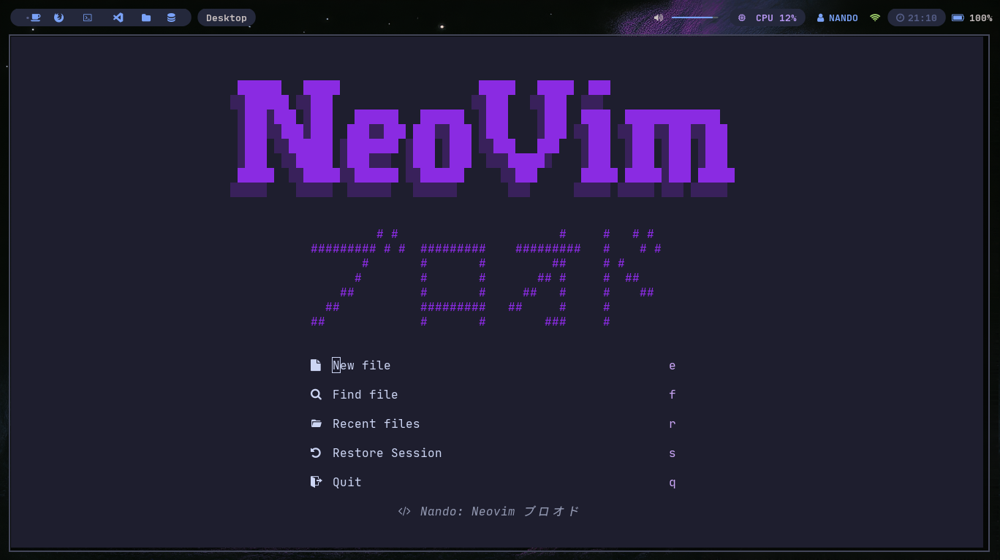

## Projeto pessoal Neovim Blood




### Pré Requisitos

> Nerd Fonts:
> https://www.nerdfonts.com/
> 
> Versão mais atual Neovim:
> https://neovim.io/

### Instalação Linux
```
git clone https://github.com/Nandoaltz/Meu_Neovim.git
mv Meu_Neovim/nvim ~/.config
rm -rf Meu_Neovim
nvim
```
### Pré Requisitos

> Nerd Fonts:
> https://www.nerdfonts.com/
> 
> Versão mais atual Neovim:
> https://neovim.io/
> 
> Verificar se existe uma pasta .config dentro do diretório pessoal

### Instalação Windows
```
git clone https://github.com/Nandoaltz/Meu_Neovim.git
Move-Item -Path "Meu_Neovim\nvim" -Destination "$env:USERPROFILE\.config" -Force
Remove-Item -Recurse -Force "Meu_Neovim"
nvim
```
