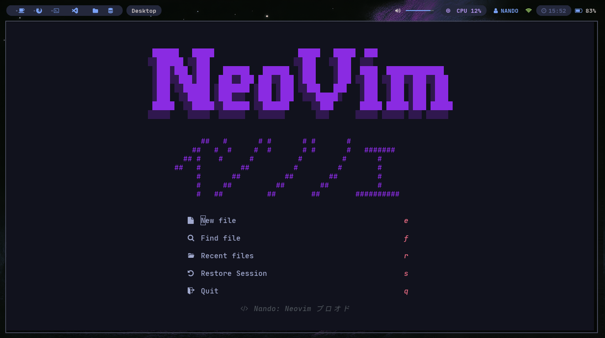

## Projeto pessoal Neovim Blood



### Pré Requisitos

> Nerd Fonts:
> https://www.nerdfonts.com/
> 
> Versão mais atual Neovim:
> https://neovim.io/

### Instalação
```
git clone https://github.com/Nandoaltz/Meu_Neovim.git
mv Meu_Neovim/nvim ~/.config
rm -rf Meu_Neovim
nvim
```
